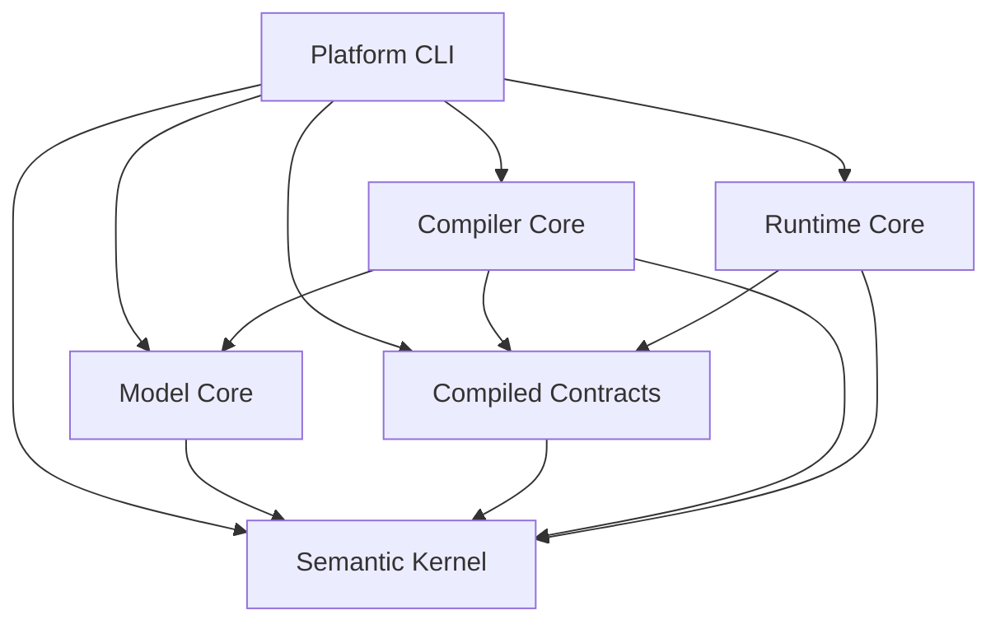

# ARC-01 architecture

The initial deployment model is one process composed of independently owned modules. Repository modularity does not imply microservices.

## Module graph

Arrows mean **depends on**; platform arrows are permitted edges; CLI arrows are observed development inspection edges, not fabricated feature implementations.

CLI inspects workspace metadata and uses explicit static public registration imports; it does not invoke future compiler/runtime behavior. `compiled-contracts` is a meaningful independent seam so neither compiler nor runtime owns the other's implementation. Its current public marker does not pretend to implement semantic IR.

Read [structure](repository-structure.md), [rules](dependency-rules.md), [guidelines](module-guidelines.md), [ADR-0001](decisions/ADR-0001-modular-monolith.md), [ADR-0002](decisions/ADR-0002-python-workspace.md) and [verification](verification.md).

ARC-02 now enforces dependency governance. Selected future adapters are Angular/PrimeNG and Django/DRF with contract-based mock data; no framework behavior is implemented. See ADR-0003 and ADR-0004.

ARC-03 provides [executable architecture fitness functions](fitness-tests.md), maintaining ARC-02 policies while separating discovery, rules and reporting. ADR-0005 records the harness and governed temporary exceptions. No semantic implementation or UI/API behavior is added.
