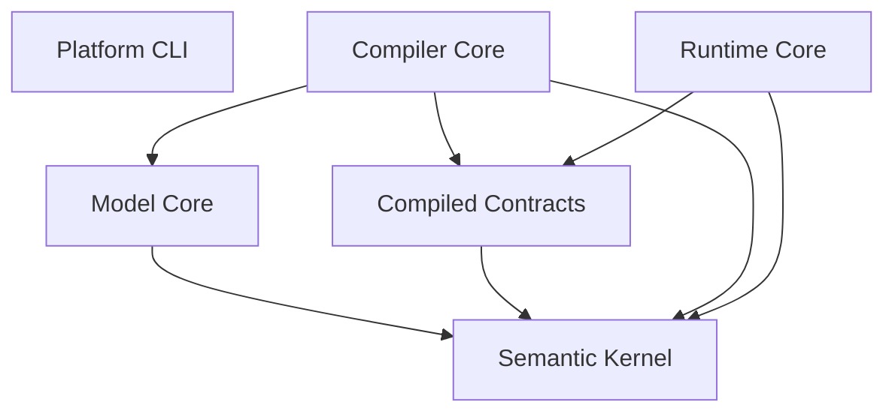

# ARC-01 architecture

The initial deployment model is one process composed of independently owned modules. Repository modularity does not imply microservices.

## Module graph

Arrows mean **depends on**; these are permitted edges, not fabricated feature implementations.

CLI inspects workspace metadata and imports public registration markers; it does not invoke future compiler/runtime behavior. `compiled-contracts` is a meaningful independent seam so neither compiler nor runtime owns the other's implementation. Its current public marker does not pretend to implement semantic IR.

Read [structure](repository-structure.md), [rules](dependency-rules.md), [guidelines](module-guidelines.md), [ADR-0001](decisions/ADR-0001-modular-monolith.md), [ADR-0002](decisions/ADR-0002-python-workspace.md) and [verification](verification.md).

ARC-02 should refine contract versioning and dependency policies before semantic implementation. No frontend, persistence, network transport or service is selected by ARC-01.
