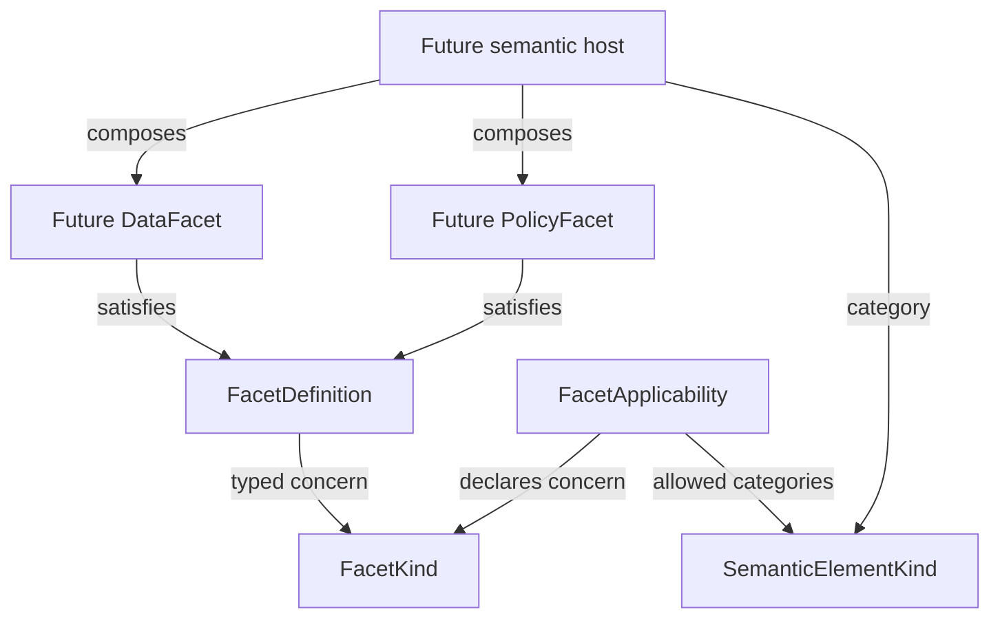

# SK-10: Facet Base Contract

## Existing state and prerequisite gap

The inspected main contains ARC-01..05 and SK-01..08: identity, naming, context, open element kind, exact versions, stable/exact references and the five-property SemanticElement root. No PrimitiveType/SK-09 implementation is present. SK-10's three contracts depend only on existing kinds/stdlib, so this independent base-contract stage can proceed; it does **not** claim SK-09 completion or the entire Minimum Kernel. Complete SK-09 before declaring Kernel readiness for concrete types. Production searches found no prior Facet/Trait/Feature implementation or semantic metadata bag requiring migration. CLI/bootstrap module metadata is a different concern.

## Composition decision

A facet contributes one coherent, orthogonal dimension of semantic meaning to a host definition. Use explicit typed composition instead of deep inheritance or a TypeDefinition accumulating optional persistence, API, policy and experience fields. Future specialized contracts extend the meaning carried by the minimal facet consumer contract; they need not inherit implementation behavior. The base is not a metadata dictionary, language mixin, UI component or runtime middleware chain.

Conceptual future composition (hosts and specialized facets are **not implemented** here):



## Open FacetKind and Core catalog

`semantic_kernel.public.FacetKind` is a frozen slots value storing a canonical string. Each dot-separated segment matches `[a-z][a-z0-9]*(?:-[a-z0-9]+)*`, exactly the existing element-kind lexical grammar. A private lexical helper is shared; public types, diagnostics and catalogs remain nominally distinct. Uppercase, whitespace, empty segments, slash/underscore separators, dangling/repeated hyphens and non-ASCII characters are rejected without normalization or repair. String subclasses are stored as plain strings with standard equality/hash.

Construction, `parse`, `try_parse`, `str`, typed equality/hash are provided; there is no ordering, Core membership requirement, registration, handler lookup or reflection. Unknown valid scoped **and unqualified** values survive parsing/round trips, including future platform vocabulary. Custom publishers should use scoped identifiers; unqualified publication remains reserved for platform vocabulary under future governance, not enforced through a closed parser allowlist. A namespace proves neither publisher ownership nor compiler support.

Frozen `FacetKinds` holds typed constants with one source for canonical literals; ALL/is_core inspect known vocabulary only:

| Constant | Canonical value |
| --- | --- |
| DATA | data |
| BEHAVIOR | behavior |
| LIFECYCLE | lifecycle |
| WORKFLOW | workflow |
| RULE | rule |
| POLICY | policy |
| SECURITY | security |
| API | api |
| EVENT | event |
| PERSISTENCE | persistence |
| EXPERIENCE | experience |
| SEARCH | search |
| AUDIT | audit |
| INTEGRATION | integration |

Experience expresses intent independent of Angular/Flutter/etc.; API does not imply REST/GraphQL/gRPC. Event/Policy facet concerns do not become EventDefinition/PolicyDefinition identities. Unknown `acme.routing` is valid/non-Core and is preserved; compiler support is not evaluated.

## FacetDefinition and applicability

`FacetDefinition` is a non-runtime-checkable structural Protocol with only a required read-only `kind: FacetKind` property. There is no generic production Facet instance, payload bag, ID, QName, context, independent version or owner pointer. Concrete immutable definitions must protect their own typed invariants: Python Protocol annotations do not enforce runtime types or snapshot immutability. No external static type checker was added/run. Test-only TestFacet demonstrates a frozen structural implementation and shared consumer; it is not a concrete DataFacet.

`FacetApplicability` is a frozen slots value with exactly `facet_kind: FacetKind` and `allowed_element_kinds: frozenset[SemanticElementKind]`. Supply an explicit built-in frozenset of validated kinds; mutable sets, lists, None, raw strings, runtime classes and wrong kind types are rejected. No silent iterable coercion occurs. Empty means applies nowhere, never all hosts. Duplicate kinds collapse under normal set semantics; equality/hash use the facet kind and the unordered allowed set. Custom element/facet kinds are allowed without registries.

```python
from semantic_kernel.public import FacetKinds, FacetApplicability, SemanticElementKinds

illustrative = FacetApplicability(
    FacetKinds.DATA,
    frozenset({SemanticElementKinds.TYPE_DEFINITION}),
)
```

This is illustrative representation, not a final Core applicability matrix. There is no giant switch, universal wildcard, validation engine or required-facet implication. Applicability says where a concern is allowed, not whether it is present, required, supported or compatible. Rules belong separately from facet payloads, not as fields/methods on SemanticElement. The root remains unchanged: id, qualified_name, context, kind, version, no facets collection. Not every semantic element is automatically a FacetHost.

Default future composition invariant: at most one facet per canonical kind on a host. Multiple policies should normally be contained within one typed PolicyFacet. This is documented only; no multiplicity/container engine or rejection logic is implemented yet. Future dependencies/conflicts need explicit declarations, never priority/last-write-wins or execution ordering. No speculative requires/conflictsWith fields are added now.

## Concern boundaries

FacetDefinition is a composed definition concern, not automatically a first-class SemanticElement. Independent facet identity/versioning would need a separate architecture decision. Host association belongs to external composition, not a back pointer. A facet is not a platform Capability, Extension mechanism, small annotation, code-reuse trait, tenant/deployment overlay or enabled runtime state. Extensions may later affect typed facets through explicit contracts; this is not monkey patching.

No compile/execute/persist/render/authorize/validate/to_json methods, service locator, handlers, database mappings, frontend types or registration enter these base contracts. Future external validators examine applicability/dependencies/conflicts/local semantics; compilers consume typed facets and produce specialized IR/artifacts; runtime mechanically enforces compiled semantics. SecurityFacet does not implement authorization, and AI-specific behavior is not added.

## Serialization and diagnostics

FacetKind uses explicit scalar JSON `"data"` or a caller's typed field `{"kind":"acme.routing"}`; custom text remains exact through parsing and serialization. JSON converters live outside Kernel, illustrated by contract tests. Direct json.dumps of unmapped FacetKind/TestFacet fails. Polymorphic FacetDefinition loading/serialization, handler factories and applicability wire format are deferred until concrete contracts need them; no registry-backed loader is supplied.

| Code | Meaning |
| --- | --- |
| SEM-FACET-KIND-001 | Missing/empty/all-whitespace kind |
| SEM-FACET-KIND-002 | Wrong scalar type or noncanonical grammar; segment_index when relevant |
| SEM-FACET-APP-001 | Missing facet kind |
| SEM-FACET-APP-002 | Wrong facet-kind type |
| SEM-FACET-APP-003 | Allowed categories must be explicit frozenset |
| SEM-FACET-APP-004 | An allowed category is not SemanticElementKind |

Diagnostics retain no rejected input. Missing positional constructor arguments use TypeError; safe parsing catches only its own expected error, not unexpected failures. These local codes are not a cross-subsystem Diagnostics Model (SK-11 is future work).

## Architecture and verification

All contracts remain in semantic_kernel.public, with dataclasses/re/typing only and no module dependencies. Existing ARCH-SK-002/003, general dependency/public/stdlib rules plus focused real ownership/shape/annotation tests suffice; all 44 Fitness rules remain unchanged. Tests guard the one-property behavior-free facet Protocol, semantic-kind frozenset applicability, no metadata/runtime state and unchanged root. These are scoped checks, not a general semantic/reflection analyzer. Shared lexical helper extraction preserves existing SemanticElementKind behavior, covered by the full regression suite.

Executable `FacetContractTests.test_demo_core_custom_applicability_and_invalid_kind` verifies Core data, valid/non-Core acme.routing round trip, illustrative data/type-definition declaration and Data Facet -> SEM-FACET-KIND-002. See [ADR-0016](../architecture/decisions/ADR-0016-composable-semantic-facet-model.md) and [verification](../architecture/sk10-verification.md).

Deferred: FacetHost/container, Facet Registry, composition/dependency/conflict/multiplicity/compatibility engines, independent facet versioning, polymorphic loading, Core applicability matrix and concrete Data/Policy/Persistence/etc. facets. Revisit contracts only with a concrete host/payload/wire requirement. Complete missing SK-09, then SK-11 Diagnostics Model, before TYPE-01 TypeDefinition, TYPE-02 FieldDefinition and TYPE-03 DataFacet v0. ContextDefinition ownership remains the ADR-0012 gate.
