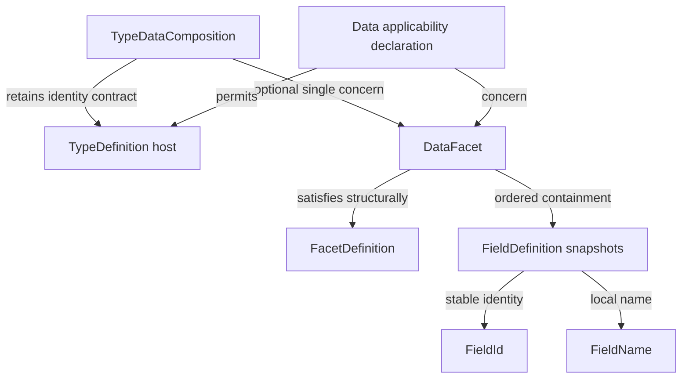

# TYPE-03: DataFacet v0

Current TYPE-04 update: FieldDefinition now requires id, name and explicit FieldConstraintSet; collection ownership, uniqueness and ordering are unchanged. See [constraints](field-constraints.md). Descriptions below of original TYPE-03 inspection and verification are historical where noted.

## Existing state and prerequisite gap

TYPE-02 supplies immutable FieldId/FieldName/FieldDefinition(id,name,constraints), and SK-10 supplies the small structural FacetDefinition Protocol, open kinds and FacetApplicability. Inspected main still lacks TYPE-01 production TypeDefinition, SK-09 PrimitiveType and SK-11 Diagnostics Model. This stage implements concrete DataFacet and a minimal host association using the existing five-property SemanticElement contract. Integration is exercised with an immutable **test-only** TypeDefinition fixture; it does not claim a production TYPE-01 implementation. Complete missing stages before claiming integrated production type-model readiness.

## DataFacet contract

`model_core.public.DataFacet` stores exactly one field, `fields: tuple[FieldDefinition,...]`, and satisfies FacetDefinition structurally through a read-only typed kind getter that always returns FacetKinds.DATA. Kind is not a constructor parameter. No inheritance from SemanticElement, independent ID/version/context, owner pointer or runtime instance values exist. Structural fields belong here, not as another source on the type core.

Constructor/create accept an explicit built-in list or tuple and defensively store a tuple. Null collections, unordered sets, arbitrary iterators, raw entries and null entries are rejected. This narrow input contract makes caller order explicit; no sorting by ID/name occurs. Field snapshots are already frozen. An empty DataFacet is valid and deliberately expresses an empty structural declaration. Mutation requires a new facet/type snapshot.

Local validation visits input order and raises the first failure, with deterministic precedence per entry: invalid field, duplicate ID, duplicate exact name, case-only portability collision. Error field_index/previous_index identify the current/first conflicting entry without retaining/echoing values. FieldId uniqueness and FieldName uniqueness are local to one facet, not a global registry. ASCII FieldName lowercasing for collision detection is locale-independent; FieldName equality remains case-sensitive. No Unicode normalization system, fuzzy lookup or alias handling is added.

find_by_id(FieldId) and find_by_name(FieldName) return the exact stored field or None. Wrong lookup types fail, rather than coercing raw strings; name lookup remains exact/case-sensitive despite construction's portability check. Linear lookup keeps v0 small with no mutable indices/caches. Snapshot equality/hash uses the ordered field tuple; reordering changes representation equality without changing field IDs or classifying compatibility. Python hash values are process-local value hashes, not stable content digests or artifact IDs.

## Minimal host composition and applicability

`TypeDataComposition(type_definition: SemanticElement, data: DataFacet | None = None)` is an explicit model-owned association rather than a general facet engine. It validates all five typed root properties and requires type-definition category. The existing root and FieldDefinition remain unchanged. The wrapper retains the host reference; the concrete host must enforce immutable snapshot invariants, as required by the root contract. A frozen wrapper cannot freeze an arbitrary mutable host implementation; this is not advertised as deep runtime immutability validation.

At most one DataFacet is representable by the single typed slot. Multiple facets/lists/arbitrary objects are rejected, never merged or last-write-wins. This small wrapper is provisional for the first concrete concern: a future general host design must replace/refine composition with typed contracts, not accumulate optional concern properties or untyped dictionaries. No FacetSet/Registry/Resolver/priority/dependency/conflict framework is added now.

DATA_FACET_APPLICABILITY is the existing frozen FacetApplicability model declaring data allowed only on SemanticElementKinds.TYPE_DEFINITION. Composition checks this actual declaration and rejects synthetic Policy/Action/non-Type hosts. TYPE-01's actual implementation is missing; consuming the root contract lets that future implementation compose DataFacet without adding direct fields. This is a contract seam, not a substitute production TypeDefinition.

None means absent data semantics; DataFacet(()) means explicitly present empty structure. No automatic facet creation collapses them. Host has no direct fields collection; the only structural source is composition.data.fields. Facet/field ownership comes from this containment, without back pointers or global owner lookup. Cross-host copying/movement and duplicate IDs across separate facets require future model-level validation, not local inference.

```python
from model_core.public import DataFacet, FieldDefinition, FieldId, FieldName

facet = DataFacet.create([
    FieldDefinition.create(
        FieldId.parse('fld_550e8400-e29b-41d4-a716-000000000000'),
        FieldName.parse('name'),
    )
])
```

Conceptual/contract integration (host is test-only until TYPE-01):



## Diagnostics, serialization and boundaries

SK-11 is missing; use existing code/message ValueError conventions in DataFacetError, not a parallel Diagnostics subsystem. Local codes:

| Code | Meaning |
| --- | --- |
| TYPE-DATA-001 | Duplicate FieldId |
| TYPE-DATA-002 | Duplicate exact FieldName |
| TYPE-DATA-003 | ASCII case-only name portability collision |
| TYPE-DATA-004 | Invalid/null field collection/entry or untyped lookup argument |
| TYPE-DATA-005 | Composition data slot is not one DataFacet or None; multiple facets cannot merge |
| TYPE-DATA-006 | Invalid typed host contract or non-type-definition applicability |

No semantic path/source location becomes an ID or stored member. A future unified diagnostics adapter can preserve codes/indices externally. Missing positional constructor parameters remain Python TypeError.

A test-only specific converter demonstrates **internal/evolving** model JSON with kind data and ordered fields:

```json
{"kind":"data","fields":[{"id":"fld_550e8400-e29b-41d4-a716-000000000000","name":"name","constraints":{"presence":"required","nullability":"non-null","values":[]}}]}
```

Field order, IDs and exact names survive round trips; parsed values pass primitive and DataFacet validation. This is not a final public Authoring Schema before TYPE-04/05. No runtime class discriminator, generic polymorphic loader, serializer framework or automatic json.dumps support enters the model. Production host serialization is not claimed while TYPE-01 is absent.

Type references remain absent; TYPE-04 constraints are explicit typed snapshots. No raw type strings/object/null placeholder, defaults/computed fields, constraint bag or actual instance values. No table/column/key/index, API/UI/search mapping, persistence/compiler methods, relationship/security or tenant/package semantics. Collection order preserves canonical/authoring fidelity; it does not mandate UI order or classify reorder/rename compatibility. No SQL migration or instance model is produced.

## Verification and next work

Actual tests verify typed facet consumption, fixed kind, tuple copying/order, duplicate IDs/names/case collisions and deterministic diagnostic indices, exact typed/missing lookup, local uniqueness, ordered equality/hash, rename identity retention, missing/empty composition, rejected multiple facets and non-Type hosts, wire round trips and Mini Sales Customer fixture. Architectural guards verify model placement, allowed model->Kernel direction, zero Kernel dependencies, no SemanticElement inheritance and no duplicated/physical structural state. Existing 44 Fitness rules remain sufficient; no duplicate rules or external static checker were added/run. Earlier field boundary expectations now admit the actual approved Kernel import while preserving field shape/independence.

The executable DataFacetContractTests.test_demo_customer_v1_and_rename_snapshot shows test-only sales.Customer@1.0.0 with ordered name/active/creditLimit and a conceptual 2.0.0 creditCeiling snapshot preserving credit FieldId. Field types/constraints are not defined, persistence/UI none, compatibility not classified.

See [ADR-0018](../architecture/decisions/ADR-0018-data-facet-structural-composition.md) and [verification](../architecture/type03-verification.md). Complete SK-09, SK-11 and TYPE-01 to adopt/test this seam with production types. Then TYPE-04 Field Constraints, TYPE-05 Type References and TYPE-06 Type Validation Rules. Deferred generic facet hosting/merge, extension augmentation, constraints/types/defaults/relationships, all projections, compatibility/migration and instance values. Future FieldDefinition extension should leave collection ownership/uniqueness/order semantics intact.
