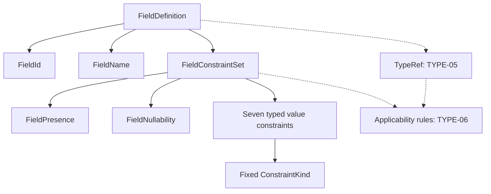

# TYPE-04: Field Constraints

## Inspected state and scope

TYPE-02 supplied FieldDefinition(id,name), TYPE-03 supplied ordered DataFacet membership and TypeDataComposition, and SK-10 supplied generic facet contracts. TYPE-01 production TypeDefinition, SK-09 PrimitiveType and SK-11 Diagnostics Model remain absent. Tests integrate with the existing immutable test-only TypeDefinition; no production host or unified diagnostics is invented. This stage represents field constraints, not field types or executable validation.

## Presence, nullability and missing

FieldPresence.REQUIRED / OPTIONAL answer whether the member must exist. FieldNullability.NULLABLE / NON_NULL answer whether a present member may contain semantic null. Canonical strings are required, optional, nullable and non-null; numeric enum ordinals and aliases are rejected. Required is not non-null; optional is not nullable. Missing is not null. Neither SQL NULL nor JavaScript undefined defines semantic state.

| Presence | Nullability | Absent member | Present null | Present non-null |
| --- | --- | --- | --- | --- |
| required | non-null | Forbidden | Forbidden | Subject to value constraints |
| required | nullable | Forbidden | Allowed | Subject to value constraints |
| optional | non-null | Allowed | Forbidden | Subject to value constraints |
| optional | nullable | Allowed | Allowed | Subject to value constraints |

This table specifies future instance semantics, **not a running instance validator**. Value constraints restrict non-null values; they do not supply defaults or override either axis. All four combinations are representable and tested separately. PATCH/operation-specific semantics remain an adapter/instance design concern.

## Actual public contracts

All definitions are owned by model_core.public. ValueConstraint is a non-runtime-checkable structural Protocol with one read-only property, kind: ConstraintKind. Concrete constraints own their typed payloads. No generic payload, runtime class-name discriminator, constraint ID/version, executable methods, type applicability, diagnostic severity, UI message or projection is part of that contract.

```python
class FieldConstraintSet:
    presence: FieldPresence
    nullability: FieldNullability
    value_constraints: tuple[ValueConstraint, ...]

# No defaults: all canonical state must be explicit.
FieldConstraintSet.create(presence, nullability, value_constraints)
# Typed lookup returns the stored value or None.
constraint_set.find_by_kind(ConstraintKind.parse('max-length'))

class FieldDefinition:
    id: FieldId
    name: FieldName
    constraints: FieldConstraintSet
```

FieldConstraintSet is a frozen slots dataclass. Constructor/create require explicit typed axes and a built-in list or tuple, defensively stored as a kind-sorted tuple. Null, sets, iterators, maps and raw/custom entries fail. At most one constraint per kind is allowed, including equal duplicates; no last-write-wins or merging. First duplicate indices preserve input provenance. Constraint order is not semantic: reordered inputs have equal snapshots/hashes and deterministic enumeration/wire order. Python hashes are process-local, not persistent digests.

ConstraintKind is an open, frozen nominal value using lower-case ASCII dot/kebab segments (`[a-z][a-z0-9]*(?:-[a-z0-9]+)*`); acme.routing-code parses/round-trips without becoming executable or payload-supported. It shares spelling conventions with kernel kinds, but never imports kernel internals or misuses another nominal kind type. ConstraintKinds is a frozen seven-member catalog, not a registry or allowlist for identifier parsing. Concrete v0 payloads are deliberately **closed**: only the seven exact frozen classes are admitted; subclasses/custom mutable implementations are rejected. Future extension schemas/support require a separate reviewed contract.

| Concrete class | Canonical kind | Payload and construction invariant |
| --- | --- | --- |
| MinLengthConstraint | min-length | Plain integer >= 0 |
| MaxLengthConstraint | max-length | Plain integer >= 0 |
| MinimumConstraint | minimum | Inclusive exact NumericConstraintValue; text convenience parses explicitly |
| MaximumConstraint | maximum | Inclusive exact NumericConstraintValue; text convenience parses explicitly |
| PatternConstraint | pattern | Non-empty exact string, uncompiled |
| PrecisionConstraint | precision | Plain integer > 0; maximum total decimal digits |
| ScaleConstraint | scale | Plain integer >= 0; declared fractional decimal digits |

No arbitrary upper limit is imposed on integer payloads. bool, float, string integers and int subclasses are rejected. Each class fixes kind through a read-only getter, never a constructor argument. Zero min/max length is valid. Scale alone and one-sided bounds are valid.

## Exact numeric literals and patterns

NumericConstraintValue stores canonical ASCII fixed-point text matching `-?[0-9]+(?:\.[0-9]+)?`, with at most **4096 digits before normalization**. This bounded representation avoids unbounded numeric parsing, permits large exact business bounds and does not rely on Python int conversion. No exponent, plus sign, whitespace, locale separators, NaN/infinity, float or implicit scalar conversion is accepted. Leading integer zeros and trailing fractional zeros normalize; all signed zero forms become 0. For example 001.000 -> 1, -000.000 -> 0, 000.1000 -> 0.1. Equivalent canonical numbers have value equality/hash. Scale declarations remain separate; a bound's spelling is not a scale declaration.

Numeric comparisons construct stdlib Decimal from validated canonical text and compare only. No float, arithmetic or context-sensitive Decimal.normalize occurs. Text construction and comparison remain exact even under precision=1 with all decimal traps enabled; long close bounds and negative ordering are tested. Numeric wire payloads are strings, never JSON numbers. NumericConstraintValue is a small bound literal, not a runtime numeric subsystem.

PatternConstraint preserves non-empty text exactly, including whitespace/newlines and engine-looking syntax; empty is rejected. It does not compile, execute, syntax-check, anchor or add flags. A text such as `[` is intentionally representable because dialect/syntax rules are **provisional**. No portable subset, full portability, matching mode or regex safety guarantee is claimed. Compiler/runtime must later specify dialect, matching semantics, limits and execution safety. Model re usage is only lexical identifiers/numeric text, never pattern evaluation.

## Local consistency and diagnostics

Construction rejects locally provable contradictions without TypeRef:

- min-length <= max-length when both exist.
- minimum <= maximum, inclusive, when both exist.
- scale <= precision when both exist.

Equality of endpoints is valid. Multiple contradiction precedence is fixed: length, numeric range, decimal digits. Pattern and precision can coexist structurally; there is no type inference or premature applicability matrix.

FieldConstraintError follows current code/message ValueError conventions, without rejected input. Optional constraint_index/previous_index report duplicate or invalid entry positions. Missing arguments are TypeError. SemanticPath awaits absent SK-11; there is no parallel diagnostics framework.

| Code | Meaning |
| --- | --- |
| TYPE-CONSTRAINT-001 / 002 | Invalid min/max length payload |
| TYPE-CONSTRAINT-003 / 004 | Inverted length/numeric bounds |
| TYPE-CONSTRAINT-005 / 006 | Invalid precision/scale payload |
| TYPE-CONSTRAINT-007 | Scale exceeds precision |
| TYPE-CONSTRAINT-008 | Duplicate kind |
| TYPE-CONSTRAINT-009 | Missing/non-text pattern; engine syntax is not checked |
| TYPE-CONSTRAINT-010 / 011 | Missing/wrong presence/nullability |
| TYPE-CONSTRAINT-012 | Invalid kind/lookup type |
| TYPE-CONSTRAINT-013 | Invalid exact numeric text/type/limit |
| TYPE-CONSTRAINT-014 | Unsupported/invalid v0 collection entry or wire kind payload |
| TYPE-CONSTRAINT-015 | Invalid internal snapshot wire shape |
| TYPE-FIELD-005 | FieldDefinition requires an explicit FieldConstraintSet |

## Field integration and serialization boundary

FieldDefinition constructor/create now **require** constraints. This intentional evolving-model API change updates all repository callers; two-argument construction is rejected rather than assigning hidden presence/nullability defaults. Field IDs/names retain TYPE-02 semantics. New constraints produce a new FieldDefinition/DataFacet snapshot under the owning type version; equality/hash include constraints while `.id` still answers member identity. No compatibility classifier or version incrementer is added. DataFacet continues to preserve field order, local ID/name uniqueness and ASCII case-collision checks without copying or merging constraints.

`model_core.constraint_wire` supplies **internal/evolving** explicit mapping functions: constraints_to_wire/from_wire and field_to_wire/from_wire. It is not exported as a public cross-module API, a final authoring schema or a generic polymorphic loader. It uses plain mappings without a JSON/framework dependency; callers perform JSON encoding. It rejects missing/extra keys, aliases, malformed typed payloads and unknown payload kinds. Open unknown kind identifiers remain valid on their own, but no arbitrary payload preservation is claimed. Construction delegates to model invariants. Output mappings are fresh; mutating them cannot mutate snapshots.

```json
{
  "id": "fld_550e8400-e29b-41d4-a716-000000000002",
  "name": "creditLimit",
  "constraints": {
    "presence": "optional",
    "nullability": "non-null",
    "values": [
      {"kind": "minimum", "value": "0"},
      {"kind": "precision", "value": 18},
      {"kind": "scale", "value": 2}
    ]
  }
}
```

Direct json.dumps(model_object) still fails; there are no serializer attributes or model methods. TYPE-05 will evolve this field mapping. Production host serialization is not claimed while TYPE-01 is absent.

## Structure and demo



The executable `ConstraintContractTests.test_sales_demo_actual_mapping` creates name (required/non-null/max-length 200), middleName (optional/nullable/no value constraints) and creditLimit (optional/non-null/minimum 0/precision 18/scale 2), then round-trips all fields. Another test composes sales.Customer through the test-only host and demonstrates a new owner version with preserved FieldId and changed name constraints. Type references are deferred to TYPE-05 and applicability to TYPE-06. This does not certify String/Decimal compatibility.

## Architecture and deferred work

Existing ARCH-DEP-002, ARCH-API-001/002, ARCH-EXT-001, ARCH-DYNAMIC-001 and kernel direction rules already prohibit infrastructure/compiler/runtime dependencies and private API leaks. Three additional focused architecture **tests**, not redundant engine rules, verify model ownership/import capabilities, exact FieldConstraintSet/FieldDefinition public shape, distinct axes and absence of executable/physical state. The existing 44 fitness rules remain unchanged.

No SQL/database constraints, runtime validation, executable expressions, API schemas, UI messages, compiler methods, cross-field/conditional rules, defaults, unique/identity constraints, allowed-values subsystem, compatibility classification or migration generation are introduced. Persistence/API/UI consume future projections, never define constraint source semantics.

See [ADR-0019](../architecture/decisions/ADR-0019-field-presence-nullability-and-constraints.md) and [verification](../architecture/type04-verification.md). Next requested stage is TYPE-05 Type References, then TYPE-06 Type Validation Rules. Resolve missing SK-09/SK-11/TYPE-01 before claiming complete production type integration.
