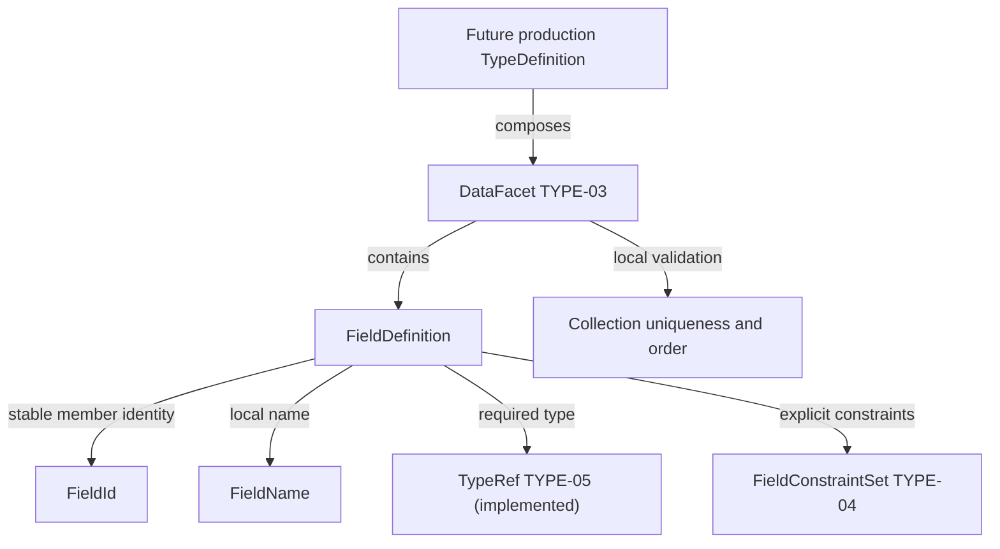

# FieldDefinition: identity, local naming and explicit constraints

TYPE-05 evolves the TYPE-02..04 contract: required TypeRef now joins id/name/constraints. See [Type References](type-references.md). TYPE-04 first introduced explicit constraints: constructors now require an explicit FieldConstraintSet. The historical TYPE-02 verification record remains unchanged. See [Field Constraints](field-constraints.md) for current presence/nullability, payload and serialization semantics.

## Inspected state and scope

The inspected main contains ARC-01..05, SK-01..08 and SK-10. model-core previously exposed only its foundation MODULE_NAME boundary; no TypeDefinition, temporary property abstraction or field API exists. SK-09 PrimitiveType, SK-11 Diagnostics Model and TYPE-01 TypeDefinition are absent. This stage implements only independent field identity/name snapshots; it does not implement/reimplement TypeDefinition or claim missing prerequisites complete. Future DataFacet/type integration requires those stages first.

FieldDefinition is an owned structural semantic member, not a SemanticElement or a physical/programming/transport/presentation field. Its collection host is a type's DataFacet. Identity/naming semantics are stable early; the full FieldDefinition property set and serialized shape intentionally evolve through TYPE-04/05.

## Public model contract and identity

The original six field public types live in `model_core.public`, not the minimal Semantic Kernel: FieldId/FieldIdError, FieldName/FieldNameError, FieldDefinition/FieldDefinitionError. No dependency direction changes, modules or bootstrap registrations are needed. Current model-core uses approved dataclasses/re/enum/decimal/typing, local snapshot mapping and Kernel public facet/host contracts. Kernel never imports model fields.

FieldId is a frozen slots value with canonical `fld_<hyphenated UUIDv4>` text. It follows SK-01's representation strategy with a distinct prefix and nominal type: lowercase hex canonicalization, strict lowercase prefix, validated UUID version 4/RFC variant, no whitespace/alternative forms. It is opaque, not derived from type/name/hash/order. There is no generator or randomness in construction/parsing. Existing Kernel validation is private and specific to SemanticElementId, so it is not imported, wrapped or exposed as a model ID. A small model-owned regex implements the same established strategy without cross-boundary internal coupling or speculative generic ID hierarchy.

Provide constructor, parse, try_parse and str. Typed equality/hash uses canonical value; FieldId is unequal to a raw string or SemanticElementId and has no ordering. Once assigned to a persisted/published field, preserve it across subsequent edits unless intentionally replacing the field; do not regenerate IDs on every compile. Allocation/canonicalization authoring lifecycle is deferred.

Field ownership matters: copying an ID into another declaring type does not establish movement continuity or imply migration. Future precise FieldRef may require owning type coordinate plus FieldId; no global field registry is assumed. FieldId itself stores no owner or path.

## Local naming and construction

FieldName is a frozen slots value with ASCII `[A-Za-z][A-Za-z0-9_]*`. It preserves exact case; creditLimit and CreditLimit differ. No trim, case/style conversion, dot/path/namespace, label or projection semantics occur. LowerCamelCase can be authoring style later, not lexical validity now. class/namespace/type/record and order/group/user remain valid; adapters/code generators handle reserved words. Names id, createdAt, tenantId or a suffix Id have no automatic identity/audit/relationship/security meaning.

FieldDefinition is a frozen slots dataclass with exactly:

| Field | Type |
| --- | --- |
| id | FieldId |
| name | FieldName |
| type | TypeRef |
| constraints | FieldConstraintSet |

Constructor and create require all four explicit validated typed values and retain them without reparsing. No raw strings, QName, SemanticElementId or omitted/default members are accepted. There is no SemanticElement inheritance, owner pointer, independent version, any/object placeholder, raw constraint bag, combined required/nullability boolean, default/computed/read-only flag, ordering, DB/API/UI/search mapping, registry, resolution, compiler/runtime methods or metadata bag.

```python
from model_core.public import FieldId, FieldName, FieldDefinition, FieldConstraintSet, FieldPresence, FieldNullability, PrimitiveTypeRef
from semantic_kernel.public import PrimitiveTypes

identity = FieldId.parse('fld_550e8400-e29b-41d4-a716-446655440000')
constraints = FieldConstraintSet(FieldPresence.OPTIONAL, FieldNullability.NON_NULL, ())
old = FieldDefinition.create(identity, FieldName.parse('creditLimit'), PrimitiveTypeRef(PrimitiveTypes.DECIMAL), constraints)
renamed = FieldDefinition.create(identity, FieldName.parse('creditCeiling'), PrimitiveTypeRef(PrimitiveTypes.DECIMAL), constraints)
assert old.id == renamed.id
assert old != renamed
```

Snapshot equality/hash includes id, name, type and constraints. Identity comparisons use `.id`; changing name produces a new snapshot with the same identity and different snapshot equality. This represents possible rename without automatic compatibility/migration classification. Different IDs may have the same name; duplicate IDs/names and case collisions are collection-level DataFacet validation, not local FieldName/FieldDefinition decisions.

## Projections, order and planned evolution

A field is semantic source data, not a runtime-language property, SQL/ORM column/FK, API/JSON property, search index field or form field. Physical names, labels/localization, indexing, primary keys and presentation order belong to projections/facets. No name infers those semantics.

Ordering never defines field identity. TYPE-03 preserves deterministic authoring/serialization collection order separately; no order/position/ordinal is stored here. Presence/nullability are explicit independent TYPE-04 enums; defaults remain deferred. TYPE-05 supplies primitive/semantic TypeRef; TYPE-06 checks applicability separately; no raw string/object/null type placeholder is introduced. Full property set is evolving until those contracts are designed; no final composition shape is promised.

DataFacet and constraints exist; production TypeDefinition remains deferred:



## Local diagnostics and internal serialization

SK-11 is absent, so follow existing code/message ValueError conventions instead of inventing a Diagnostics Model. Each primitive/construction error has its own type and retains no rejected input:

| Code | Meaning |
| --- | --- |
| TYPE-FIELD-001 | Field ID missing/empty/all-whitespace scalar, or None typed ID |
| TYPE-FIELD-002 | Wrong typed ID, scalar type or noncanonical fld_UUIDv4 format |
| TYPE-FIELD-003 | Field name missing/empty/all-whitespace scalar, or None typed name |
| TYPE-FIELD-004 | Wrong typed name, scalar type or invalid local ASCII grammar |
| TYPE-FIELD-005 | Missing or wrong typed FieldConstraintSet |

Missing positional arguments use TypeError. try_parse returns None only for its expected primitive error; unexpected failures propagate. Future SK-11 integration must preserve diagnostic meanings without introducing dependencies on compiler/UI frameworks.

Explicit scalar mappings retain canonical ID and exact name. The current internal/evolving field mapping also requires type and constraints (presence, nullability and values); old two-member wire mappings are rejected without hidden defaults. `model_core.constraint_wire` implements explicit encode/decode mappings without JSON/framework imports or exports on the public cross-module surface. See [actual wire example](field-constraints.md#field-integration-and-serialization-boundary). The internal shape remains evolving rather than a final authoring schema. Direct json.dumps of model values fails; repr is not wire format.

## Architecture, demo and next work

Existing dependency/public/stdlib rules protect direction and neutrality. Focused tests verify exact id/name/constraints shape, owned-member rather than SemanticElement semantics, stable identities, explicit constraints and no physical/framework leakage. DataFacet preserves local duplicate ID/name rejection, case portability and ordering. No compatibility/migration classification is inferred from renamed or differently constrained snapshots.

See [ADR-0017](../architecture/decisions/ADR-0017-field-identity-and-local-naming.md), [ADR-0019](../architecture/decisions/ADR-0019-field-presence-nullability-and-constraints.md) and the current [constraint contract](field-constraints.md). TYPE-05 supplies TypeRef; TYPE-06 applicability is available; TYPE-07 registry is next. Full SK-09, SK-11 and production TYPE-01 gaps remain prerequisites for complete production type integration. Defaults, computed fields, owner-aware FieldRef, registry resolution, compatibility/diff/migration and all physical/API/UI/search mappings remain deferred.
