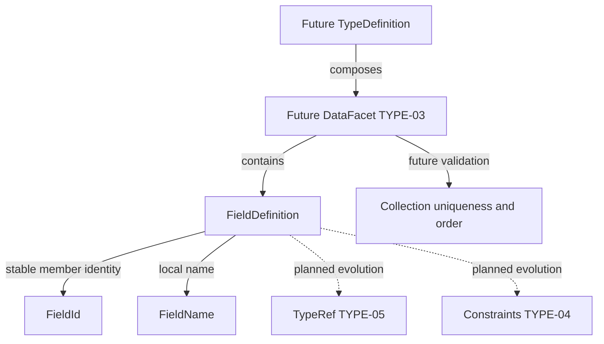

# TYPE-02: FieldDefinition

## Inspected state and scope

The inspected main contains ARC-01..05, SK-01..08 and SK-10. model-core previously exposed only its foundation MODULE_NAME boundary; no TypeDefinition, temporary property abstraction or field API exists. SK-09 PrimitiveType, SK-11 Diagnostics Model and TYPE-01 TypeDefinition are absent. This stage implements only independent field identity/name snapshots; it does not implement/reimplement TypeDefinition or claim missing prerequisites complete. Future DataFacet/type integration requires those stages first.

FieldDefinition is an owned structural semantic member, not a SemanticElement or a physical/programming/transport/presentation field. Its future host is a type's DataFacet. Identity/naming semantics are stable early; the full FieldDefinition property set and serialized shape intentionally evolve through TYPE-04/05.

## Public model contract and identity

All six public types live in `model_core.public`, not the minimal Semantic Kernel: FieldId/FieldIdError, FieldName/FieldNameError, FieldDefinition/FieldDefinitionError. No dependency direction changes, modules or bootstrap registrations are needed. Source uses dataclasses/re only; model-core does not need to import Kernel for this small independent component, while its allowed dependency remains Kernel. Kernel never imports model fields.

FieldId is a frozen slots value with canonical `fld_<hyphenated UUIDv4>` text. It follows SK-01's representation strategy with a distinct prefix and nominal type: lowercase hex canonicalization, strict lowercase prefix, validated UUID version 4/RFC variant, no whitespace/alternative forms. It is opaque, not derived from type/name/hash/order. There is no generator or randomness in construction/parsing. Existing Kernel validation is private and specific to SemanticElementId, so it is not imported, wrapped or exposed as a model ID. A small model-owned regex implements the same established strategy without cross-boundary internal coupling or speculative generic ID hierarchy.

Provide constructor, parse, try_parse and str. Typed equality/hash uses canonical value; FieldId is unequal to a raw string or SemanticElementId and has no ordering. Once assigned to a persisted/published field, preserve it across subsequent edits unless intentionally replacing the field; do not regenerate IDs on every compile. Allocation/canonicalization authoring lifecycle is deferred.

Field ownership matters: copying an ID into another declaring type does not establish movement continuity or imply migration. Future precise FieldRef may require owning type coordinate plus FieldId; no global field registry is assumed. FieldId itself stores no owner or path.

## Local naming and construction

FieldName is a frozen slots value with ASCII `[A-Za-z][A-Za-z0-9_]*`. It preserves exact case; creditLimit and CreditLimit differ. No trim, case/style conversion, dot/path/namespace, label or projection semantics occur. LowerCamelCase can be authoring style later, not lexical validity now. class/namespace/type/record and order/group/user remain valid; adapters/code generators handle reserved words. Names id, createdAt, tenantId or a suffix Id have no automatic identity/audit/relationship/security meaning.

FieldDefinition is a frozen slots dataclass with exactly:

| Field | Type |
| --- | --- |
| id | FieldId |
| name | FieldName |

Both constructor and create require validated typed values and retain them without reparsing. No raw strings, QName, SemanticElementId or omitted/default members are accepted. There is no SemanticElement inheritance, owner pointer, independent version, type/any/object placeholder, constraint, required/nullability flag, default/computed/read-only flag, ordering, DB/API/UI/search mapping, registry, resolution, compiler/runtime methods or metadata bag.

```python
from model_core.public import FieldId, FieldName, FieldDefinition

identity = FieldId.parse('fld_550e8400-e29b-41d4-a716-446655440000')
old = FieldDefinition.create(identity, FieldName.parse('creditLimit'))
renamed = FieldDefinition.create(identity, FieldName.parse('creditCeiling'))
assert old.id == renamed.id
assert old != renamed
```

Snapshot equality/hash includes id and name. Identity comparisons use `.id`; changing name produces a new snapshot with the same identity and different snapshot equality. This represents possible rename without automatic compatibility/migration classification. Different IDs may have the same name; duplicate IDs/names and case collisions are collection-level future DataFacet/type validation, not local FieldName/FieldDefinition decisions.

## Projections, order and planned evolution

A field is semantic source data, not a runtime-language property, SQL/ORM column/FK, API/JSON property, search index field or form field. Physical names, labels/localization, indexing, primary keys and presentation order belong to projections/facets. No name infers those semantics.

Ordering never defines field identity. TYPE-03 may preserve deterministic authoring/serialization collection order separately; no order/position/ordinal is stored here. Required/optional/missing/null/default semantics are deferred to TYPE-04 rather than reduced to booleans. TYPE-05 supplies correct primitive/semantic TypeRef semantics; no raw string/object/null type placeholder is introduced. Full property set is evolving until those contracts are designed; no final composition shape is promised.

Conceptual integration only (TypeDefinition/DataFacet/TypeRef/Constraints are not implemented):



## Local diagnostics and internal serialization

SK-11 is absent, so follow existing code/message ValueError conventions instead of inventing a Diagnostics Model. Each primitive/construction error has its own type and retains no rejected input:

| Code | Meaning |
| --- | --- |
| TYPE-FIELD-001 | Field ID missing/empty/all-whitespace scalar, or None typed ID |
| TYPE-FIELD-002 | Wrong typed ID, scalar type or noncanonical fld_UUIDv4 format |
| TYPE-FIELD-003 | Field name missing/empty/all-whitespace scalar, or None typed name |
| TYPE-FIELD-004 | Wrong typed name, scalar type or invalid local ASCII grammar |

Missing positional arguments use TypeError. try_parse returns None only for its expected primitive error; unexpected failures propagate. Future SK-11 integration must preserve diagnostic meanings without introducing dependencies on compiler/UI frameworks.

Explicit scalar mappings use canonical ID and exact name text. A **test-only internal/evolving** model mapping demonstrates:

```json
{"id":"fld_550e8400-e29b-41d4-a716-446655440000","name":"creditLimit"}
```

This is not a final externally stable field wire schema and no schema/release is published. It will evolve at least through TYPE-05. Tests map/parse each typed scalar outside model-core; no serializer framework or to_json methods enter the value. Direct json.dumps of unmapped values fails. Native dataclass repr is diagnostic only and never a wire contract.

## Architecture, demo and next work

Existing dependency/public/stdlib rules plus ARCH-SK-002/003 protect direction/neutrality; focused actual ownership, shape, MRO and import tests verify model placement, no SemanticElement inheritance, only FieldId/FieldName state and no physical/framework leakage. All 44 Fitness rules remain unchanged; no redundant rule or external static type checker was added/run.

Unit fixtures model only Customer name/active, Product name/price and SalesOrder orderNumber/orderDate fields, not full semantic types. `FieldSerializationTests.test_demo_rename_identity_without_compatibility_classification` demonstrates creditLimit -> creditCeiling with preserved ID. All tests are pure, with no registry or resolution.

See [ADR-0017](../architecture/decisions/ADR-0017-field-identity-and-local-naming.md) and [verification](../architecture/type02-verification.md). Complete missing SK-09, SK-11 and TYPE-01 before integrating TYPE-03 DataFacet v0, then TYPE-04 constraints and TYPE-05 references. Deferred: DataFacet, TypeRef, constraints/requiredness/nullability/defaults, computed fields, owner-aware FieldRef, registries, compatibility/diff/migration and all physical/API/UI/search mappings. Full type/constraint composition, authoring ID retention, duplicate/case-collision policy and movement semantics remain explicit design seams.
