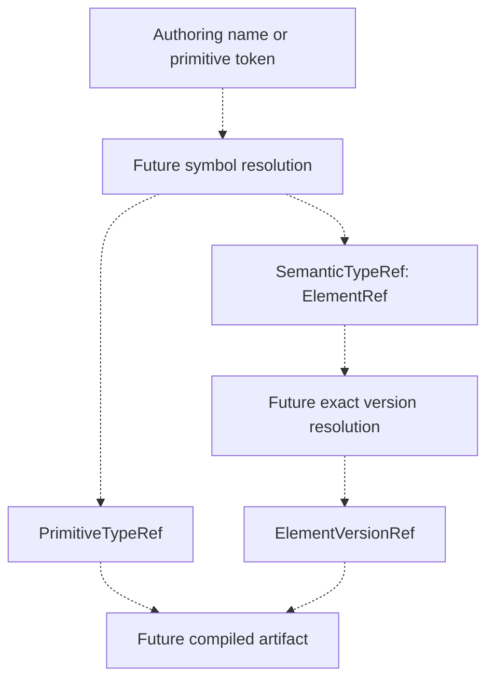
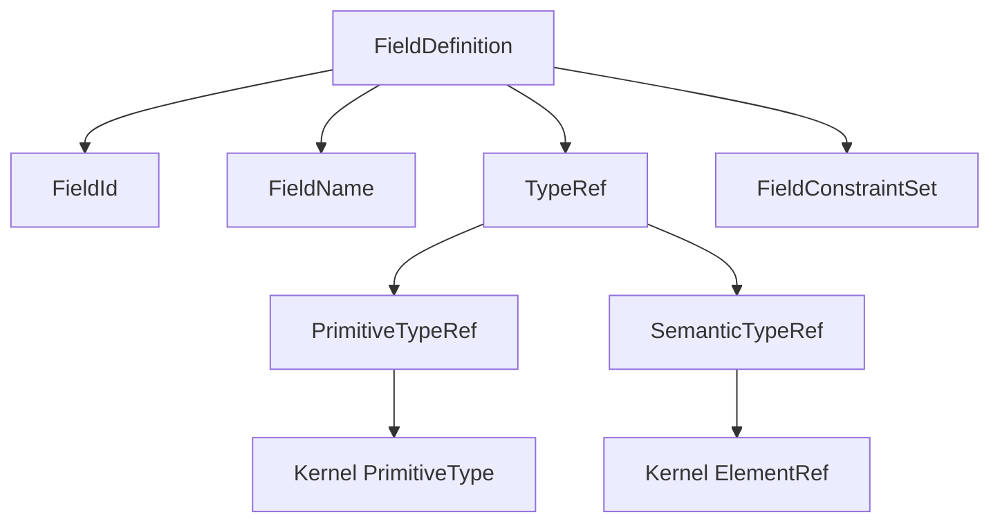

# TYPE-05: Type References

## Existing state and reconciliation

Inspected main has FieldDefinition(id,name,constraints), DataFacet and TypeDataComposition from TYPE-02..04, plus SK-08 stable ElementRef and exact ElementVersionRef. No existing TypeRef/placeholder/raw production field type or SK-09 PrimitiveType exists. No duplicate TypeRef is introduced. TYPE-01 production TypeDefinition and SK-11 Diagnostics Model remain missing.

Because references need a typed primitive foundation, this stage adds the **minimal seven-token PrimitiveType prerequisite** to Kernel public contracts. It does not claim full SK-09 completion without that specification. All primitive references reuse that single kernel contract; no model-local primitive copy exists. Semantic references reuse the existing ElementRef. Integration remains through the immutable test-only TypeDefinition fixture, not a claimed production host.

## Actual public algebra

```python
# model_core.public
class TypeRefKind(Enum):
    PRIMITIVE = 'primitive'
    SEMANTIC = 'semantic'

@dataclass(frozen=True, slots=True)
class PrimitiveTypeRef:
    primitive: PrimitiveType
    # read-only kind -> TypeRefKind.PRIMITIVE

@dataclass(frozen=True, slots=True)
class SemanticTypeRef:
    target: ElementRef
    # read-only kind -> TypeRefKind.SEMANTIC

TypeRef = PrimitiveTypeRef | SemanticTypeRef

class FieldDefinition:
    id: FieldId
    name: FieldName
    type: TypeRef
    constraints: FieldConstraintSet

FieldDefinition.create(id, name, type, constraints)
```

TypeRef is a Python closed union of two concrete frozen variants, not an instantiable base or a Protocol admitting arbitrary unknown payloads. Field construction additionally checks exact variant classes, rejecting custom objects/subclasses, raw strings, loaded host objects and direct ElementRef. There is no Any/Object/Dynamic/Unknown escape hatch. Each variant fixes its read-only kind; there are no optional payload combinations, caller-controlled kind or ambiguous states.

PrimitiveTypeRef requires an exact validated Kernel PrimitiveType and retains it; PrimitiveTypeRef('string') is rejected. The catalog supplies STRING, BOOLEAN, INTEGER, DECIMAL, DATE, DATETIME and UUID with canonical string/boolean/integer/decimal/date/datetime/uuid tokens. No language Class/Type, SQL type, array syntax or alias is accepted. Primitive values describe semantic expectations, not physical representations.

SemanticTypeRef requires an exact identity-only ElementRef and retains it. It expresses intent to target a TypeDefinition. It does **not** prove existence or target kind and does no loading/lookup. SemanticElementId, raw scalar, QName, SemanticContextRef, ElementVersionRef or loaded definition cannot substitute for ElementRef. Construction is valid even if the target is not known to any current registry.

Equality/hash are nominal value semantics: equal primitive values produce equal primitive refs; equal stable IDs produce equal semantic refs; different IDs/types differ. Primitive STRING remains distinct from a semantic sales.String definition. Snapshots are frozen through their typed nested values; Python hashes are process-local, not persistent digests.

## Identity, authoring names and exact versions

SemanticTypeRef stores only stable identity. Rename, namespace/context movement or target-version evolution with retained SemanticElementId leave the logical reference unchanged. QualifiedName is an authoring/display coordinate, never a canonical target or a stale hint stored here. An authoring form such as `type: sales.Customer` would later resolve into SemanticTypeRef(ElementRef(id)); `type: decimal` would resolve into PrimitiveTypeRef(PrimitiveTypes.DECIMAL). These are documentation examples only; no authoring parser, namespace/import/alias resolver or heuristic compact syntax is added.

The logical semantic ref is identity-pinned, not automatically latest or exact-version-pinned. Future version resolution may produce ElementVersionRef for compiled artifacts through a separate resolved contract. This stage does not add optional version, selectors/ranges, latest, registry pointers or versioned SemanticTypeRef. Existing ElementVersionRef stays distinct; no exact version is guessed or selected here.



Dashed transitions are future work. TYPE-05 implements the typed reference representations in the middle, not either resolution engine.

## Field integration, constraints and recursion

Canonical FieldDefinition now requires all four typed members. No constructor/factory default supplies a missing type; previous three-argument callers and wire examples must specify type explicitly. All repository fixtures are updated; generic structural fixtures explicitly use representative STRING values, while the Sales demo uses appropriate explicit STRING/BOOLEAN/DECIMAL choices. Type is not inferred from field names or constraints in production.

Presence/nullability remain independent in FieldConstraintSet; no Nullable/Optional wrappers, collection cardinality or constraints are moved into TypeRef. Existing four-state semantics and local consistency checks are unchanged. String with PrecisionConstraint(18) remains structurally representable here: applicability must be checked by TYPE-06. TypeRef performs no constraint matrix, assignability, coercion or runtime value conversion.

Changing type produces a new FieldDefinition snapshot; identity comparisons still use FieldId and snapshot equality/hash now include type. A tested INTEGER -> DECIMAL snapshot retains field identity/constraints; no breaking-change or migration decision is inferred. Owner version updates remain separate immutable host snapshots.

Self refs (Employee.manager -> Employee) and mutual refs (A.fieldB -> B, B.fieldA -> A) store IDs only, so definitions can be built/serialized without recursive host objects or eager loading. Tests demonstrate finite wire round trips. This does not approve graph-wide validity or require a registry.

A semantic field may later represent an embedded value or another storage strategy. SemanticTypeRef does not imply RelationshipDefinition, foreign key, cardinality or persistence ownership. Runtime language/DB/API/UI/search/AI representations are projections.



## Actual internal serialization

The existing model_core.constraint_wire internal adapter adds type_ref_to_wire/from_wire and extends field_to_wire/from_wire. These are evolving snapshot mapping functions, not public cross-module exports, serializer framework types or a final authoring schema. Output is fresh plain mappings; JSON encoding belongs to callers. Explicit semantic discriminators replace class-name/repr/compact heuristics:

```json
{"kind":"primitive","primitive":"string"}
```

```json
{"kind":"semantic","elementRef":"sem_550e8400-e29b-41d4-a716-446655440000"}
```

Primitive wire tokens come from PrimitiveType. Semantic target text is exactly SK-08 ElementRef canonical scalar form; no new identity syntax is invented. Variant mapping rejects missing/extra members, noncanonical/numeric discriminator, optional version, QName hints and mixed payloads. Foundational invalid primitive/ElementRef errors propagate with existing meanings. Open unknown semantic element IDs remain syntactically valid, without lookup.

```json
{
  "id":"fld_550e8400-e29b-41d4-a716-000000000002",
  "name":"creditLimit",
  "type":{"kind":"primitive","primitive":"decimal"},
  "constraints":{
    "presence":"optional",
    "nullability":"non-null",
    "values":[
      {"kind":"minimum","value":"0"},
      {"kind":"precision","value":18},
      {"kind":"scale","value":2}
    ]
  }
}
```

Legacy fields without type fail rather than receiving implicit defaults. Mutating a wire mapping cannot mutate a reference/field. Direct json.dumps of model objects still fails. Logical host JSON serialization is not claimed while production TYPE-01 is absent.

## Diagnostics and architecture

SK-11 remains absent; TypeRefError follows current code/message ValueError conventions without rejected input. TYPE-REF-001 means missing field/ref wire type, 002 invalid typed primitive payload, 003 invalid typed semantic payload, 004 invalid variant/discriminator/shape, 005 missing semantic target. Missing positional arguments use TypeError; complete field-mapping shape errors continue using the existing TYPE-CONSTRAINT-015 adapter diagnostic. Primitive/ElementRef parse errors retain their foundational codes. Existence, non-Type target, unsupported applicability or unresolved version are not construction errors invented here.

Kernel PrimitiveType has no module dependencies; model-core uses Kernel public PrimitiveType/ElementRef, never private symbols. TypeRef stays model-owned and does not depend on TypeDefinition, registry, compiler, runtime, HTTP, persistence or frontend. Existing 44 Fitness rules for neutrality, dependency direction, public APIs and forbidden infrastructure remain active. Three focused architecture tests cover actual closed variant shapes, required union field type, primitive ownership/kernel independence, and absence of name/version/nullable/execution/physical members. No redundant engine rule, module or bootstrap registration is added.

## Executable Mini Sales demo and next work

`TypeReferenceContractTests.test_sales_customer_and_order_demo` composes test-only sales.Customer@1.0.0:

| Field | TypeRef | Presence | Nullability | Value constraints |
| --- | --- | --- | --- | --- |
| name | Primitive STRING | required | non-null | max-length 200 |
| active | Primitive BOOLEAN | required | non-null | none |
| creditLimit | Primitive DECIMAL | optional | non-null | minimum 0, precision 18, scale 2 |

A test-only sales.SalesOrder.customer stores SemanticTypeRef(ElementRef(Customer ID)), without the name, target object, version or relationship. Both variants and fields round-trip through actual mappings. Other tests verify renamed target stability and self/mutual finite references. These demonstrate representation, not applicability certification.

See [ADR-0020](../architecture/decisions/ADR-0020-semantic-type-reference-strategy.md) and [verification](../architecture/type05-verification.md). Next requested stage is TYPE-06 Type Validation Rules, then TYPE-07 Registry. Resolve production TYPE-01, full SK-09 and SK-11 gaps before claiming complete production type integration. Deferred: symbolic references/resolution, target existence/kind, applicability, assignability/coercion, registry, collection/generic constructors, exact-version resolution, relationships, runtime validation and all physical projections/compatibility/migration.
