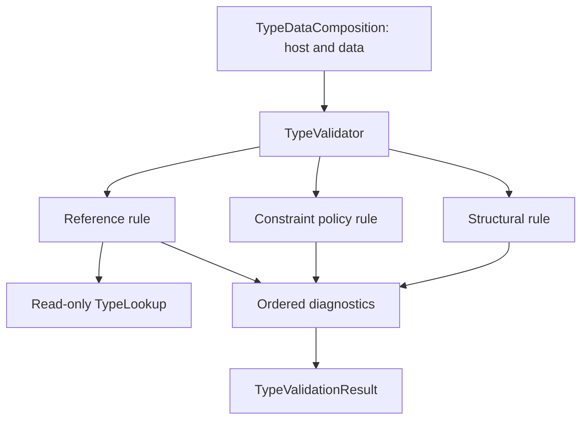

# TYPE-06: Type Validation Rules

## Inspected state and actual integration boundary

TYPE-02..05 provide immutable fields, DataFacet, explicit constraints and closed PrimitiveTypeRef/SemanticTypeRef references. Constructors already reject malformed values, missing field members, local duplicates/case collisions, repeated constraint kinds and inverted local bounds. There were no cross-object validation helpers, TypeLookup, Diagnostic/SemanticPath contracts or pipeline to reconcile. Existing checks stay in constructors; no duplicate algorithms are moved/copied into validation.

Production TYPE-01 TypeDefinition and SK-11 diagnostics remain absent. Full SK-09 remains incomplete beyond the minimal seven-token prerequisite introduced by TYPE-05. The actual input is the existing **TypeDataComposition** host/data seam. Tests use immutable test-only five-property SemanticElement hosts; no production TypeDefinition or Registry is invented. Type-specific TypeValidationDiagnostic/TypeValidationPath provide a clearly provisional SK-11 integration seam, without claiming unified Diagnostic/SemanticPath/SourceLocation support.

## Actual public contracts and pipeline

All types are owned by model_core.public and use approved stdlib/Kernel public contracts:

```python
class TypeLookup(Protocol):
    def find(self, reference: ElementRef) -> SemanticElement | None: ...

class TypeValidationContext:
    type_lookup: TypeLookup  # required, no ambiguous None mode

class TypeValidationRule(Protocol):
    @property
    def id(self) -> str: ...
    def validate(self, type_definition: TypeDataComposition,
                 context: TypeValidationContext) -> tuple[TypeValidationDiagnostic, ...]: ...

class TypeValidationResult:
    diagnostics: tuple[TypeValidationDiagnostic, ...]
    # derived read-only is_valid: no ERROR diagnostics

TypeValidator(additional_rules=()).validate(composition, context)
```

The default validator always runs three immutable/stateless core rules, then explicit additional rules in supplied order:

1. TYPE-RULE-STRUCTURAL: current host kind must be type-definition.
2. TYPE-RULE-FIELD-CONSTRAINT: unsupported payloads, primitive applicability, semantic-value restrictions and exact Integer bounds.
3. TYPE-RULE-SEMANTIC-REFERENCE: target existence, identity and type-definition kind.

Core rules cannot be replaced or disabled by an empty additional collection. Rule IDs must be stable and unique; a core-ID collision fails construction. Additional rule inputs are defensively copied to a tuple, with no reflection discovery, mutable global registry, service locator or plugin execution. Caller-supplied rules must obey the stateless/non-mutating/deterministic contract; the validator cannot sandbox arbitrary Python implementations.

Expected semantic errors become diagnostics. Independent errors aggregate in explicit rule order, then DataFacet field order and normalized constraint-kind order. There is no fail-fast on one bad field. No model normalization, fixing/removal, version selection, cache, compilation or instance execution occurs. Unexpected provider/rule failures and violations of typed API contracts propagate as programming/infrastructure exceptions; they are not disguised as normal invalidity.

Structural checks reuse constructor guarantees for field completeness/uniqueness, one data slot and local constraint consistency. One additional current-kind check is useful because TypeDataComposition retains a SemanticElement Protocol implementation and cannot enforce deep external immutability. It diagnoses a host whose kind changed after composition construction; it does not repeat field algorithms. Absent DataFacet and explicit empty DataFacet remain valid on a type host.



## Primitive applicability: one policy source

The immutable `_PRIMITIVE_CONSTRAINT_POLICY` in the validation section of model_core.public is the only implementation policy source. `primitive_constraint_kinds(PrimitiveType)` exposes a read-only frozenset for rules/documentation. This table is generated from that actual function, not independently maintained. Tests use an independent expected oracle across all **49 primitive × constraint combinations**.

<!-- BEGIN GENERATED MATRIX -->
| Constraint | string | boolean | integer | decimal | date | datetime | uuid |
| --- | --- | --- | --- | --- | --- | --- | --- |
| min-length | ✓ | — | — | — | — | — | — |
| max-length | ✓ | — | — | — | — | — | — |
| minimum | — | — | ✓ | ✓ | — | — | — |
| maximum | — | — | ✓ | ✓ | — | — | — |
| pattern | ✓ | — | — | — | — | — | — |
| precision | — | — | — | ✓ | — | — | — |
| scale | — | — | — | ✓ | — | — | — |
<!-- END GENERATED MATRIX -->

String accepts min/max length and pattern only. Boolean accepts none of the seven value constraints. Integer accepts minimum/maximum, additionally requiring exact integral bounds. Decimal accepts minimum/maximum/precision/scale. Date, DateTime and UUID accept no current value constraints because TYPE-04 defines no temporal/UUID-specific vocabulary. All four presence/nullability states remain valid for every primitive and SemanticTypeRef independently.

Integer integrality is checked on TYPE-04 canonical exact text, without float/int conversion or machine widths. `0.5` and `-0.50` fail; `1.000` canonicalizes to `1` and passes; signed zero and 4096-digit integer bounds pass. Decimal fractional bounds remain valid. Precision and scale can each appear alone; TYPE-04 already enforces their local relationship when both exist. Pattern eligibility is checked without compiling/executing/syntax-certifying text such as `[`. Pattern dialect and runtime safety remain provisional.

The matrix never lives in PrimitiveType, TypeRef or constraint classes, and there are no supports/allowed_constraints/self-validation methods on representations. There is no runtime value coercion, assignability or inherited ValueType unwrapping.

## Reference-aware validation and lookup scope

TypeLookup intentionally returns the broad SemanticElement contract so the validator can distinguish missing targets from existing Action/Policy/etc. targets. It is read-only: only find(ElementRef), without registration, publishing, removal, version/package/name selection or concrete Registry dependency. The context requires an implementation even for empty/primitive-only models, making `validate` consistently full current-definition validation. There is no optional lookup or intrinsic-only mode returning misleading success.

The supplied lookup must be a deterministic, unambiguous model snapshot/view and return the requested identity. TYPE-07 can implement this Protocol naturally or provide a narrow adapter. Python Protocol inherits standard ABC machinery, but the platform lookup contract declares only find; inherited ABC.register is not a semantic Registry operation.

For each semantic field, rules perform one direct lookup:

- None -> TYPE-VAL-REF-001.
- Typed element with another identity -> TYPE-VAL-REF-003.
- Requested identity with non-type-definition kind -> TYPE-VAL-REF-002.
- Requested identity and type-definition kind -> passes current reference checks.

A provider returning an object outside the five-property SemanticElement contract raises TypeError. Provider exceptions propagate. Rules import no I/O capabilities or knowledge of storage/network services; lookup implementations are responsible for supplying the intended stable read-only model view.

Self targets must be explicitly present in that view; no automatic insertion occurs. Mutual references pass direct target checks without recursively validating targets or rejecting semantic graph cycles. A referenced definition's invalid own constraints must be validated separately by later model orchestration; validating Customer does not silently certify Address's internal fields. TypeLookup composition supplies a version view; validation never picks latest, ranges or exact ElementVersionRef coordinates.

Current SemanticTypeRef fields accept presence/nullability but reject every primitive value constraint conservatively. No Entity/ValueType/Aggregate taxonomy/base-type contract exists to justify primitive constraint propagation. A future explicit ValueType contract must define support; the validator never infers a primitive from the target's first field.

## Unknown constraints fail closed

ConstraintKind remains open, but TYPE-04 closes concrete payload admission to seven exact frozen classes. Current normal construction already rejects an unsupported custom payload. The validation boundary additionally emits TYPE-VAL-CONSTRAINT-003 if an unsupported entry reaches it; unknown valid identifiers are preserved in the typed diagnostic path, not silently ignored or treated as another core kind.

A test-only object.__setattr__ bypass verifies this defensive branch for acme.routing-code. No production CustomConstraint, arbitrary JSON payload or unsafe construction API is introduced. Future extension admission/support requires a separate contract; extra rules cannot turn unsupported core constraints into silent success.

## Diagnostics, paths and determinism

TypeValidationDiagnostic is frozen with code, message, severity, path, optional field_id and optional target ElementRef. TypeValidationSeverity has ERROR/WARNING/INFO; core semantic errors are ERROR, with no speculative warning rules. TypeValidationResult stores only immutable diagnostics; is_valid is derived from the absence of ERROR, so warnings/info do not contradict a separate valid flag.

TypeValidationPath stores typed QualifiedName, optional FieldName and optional ConstraintKind. Constraint coordinates require a field. Example rendering:

```text
sales.Customer.data.fields.creditLimit.constraints.minimum
```

It is a readable semantic coordinate, not identity. Field reorder does not change its field path/FieldId association, though diagnostic sequence follows explicit DataFacet order. Host/field rename changes the displayed path while structured FieldId retains member identity. Unknown kind paths remain typed/canonical. No ordinal, metadata bag, raw instance value or source location is attached to model definitions. SK-11 integration must later reconcile these provisional type-specific contracts with its real Diagnostic/SemanticPath/SourceLocation interfaces.

| Code | Meaning |
| --- | --- |
| TYPE-VAL-STRUCTURAL-001 | Current validation host is not a type-definition/data-applicable host |
| TYPE-VAL-CONSTRAINT-001 | Constraint is not applicable to the declared primitive or semantic type |
| TYPE-VAL-CONSTRAINT-002 | Integer minimum/maximum contains a nonzero fractional component |
| TYPE-VAL-CONSTRAINT-003 | Unsupported concrete constraint at validation boundary |
| TYPE-VAL-REF-001 | Semantic target cannot be found in supplied view |
| TYPE-VAL-REF-002 | Target exists but is not a type-definition |
| TYPE-VAL-REF-003 | Lookup returned another identity than requested |

## Executable demos and architecture checks

The contract demo validates the existing test-only sales.Customer@1.0.0 fixture:

| Field | Type | Presence | Nullability | Value constraints |
| --- | --- | --- | --- | --- |
| name | string | required | non-null | max-length 200 |
| active | boolean | required | non-null | none |
| creditLimit | decimal | optional | non-null | minimum 0, precision 18, scale 2 |

It returns is_valid=True and no diagnostics. The invalid Sales demo changes name to string+precision and active to boolean+max-length, returning two ordered TYPE-VAL-CONSTRAINT-001 diagnostics at the two field paths while wire snapshots remain unchanged. Integration tests validate Customer.address with Address present, reject it when absent or an Action, and verify self/mutual refs and independent validation of invalid target data.

Existing ARCH-DEP-002, ARCH-API-001/002, ARCH-EXT-001, ARCH-DYNAMIC-001 and Kernel direction guards enforce allowed dependencies. Three focused architecture tests verify model-owned contracts, exact read-only lookup/context/result/path shapes, policy outside representations, and core rule methods without model attribute writes/I/O/recursive validation. All 44 engine Fitness rules remain unchanged; no redundant rule, module, Registry, bootstrap marker, new CLI command or external static type checker is introduced.

## Deferred work and next stage

TYPE-06 judges declarations, not actual instance values. It is not a platform-wide MOD-08 validator or compiler pass. Deferred: concrete TYPE-07 Registry, full production TYPE-01 host integration, SK-11 unified diagnostics/path/source integration, full SK-09 semantics, namespace/alias resolution, exact-version selection, instance/runtime validation, assignability/coercion, inheritance, ValueType propagation, cross-field/relationship rules, physical/API/UI/search projections, compatibility classification and migration.

See [ADR-0021](../architecture/decisions/ADR-0021-semantic-type-validation-architecture.md) and [verification](../architecture/type06-verification.md). Next requested stage TYPE-07 Type Registry should implement this read-only TypeLookup without a reverse dependency from rules to concrete registry. Missing foundational stages must be reconciled before claiming complete production type-system readiness.
